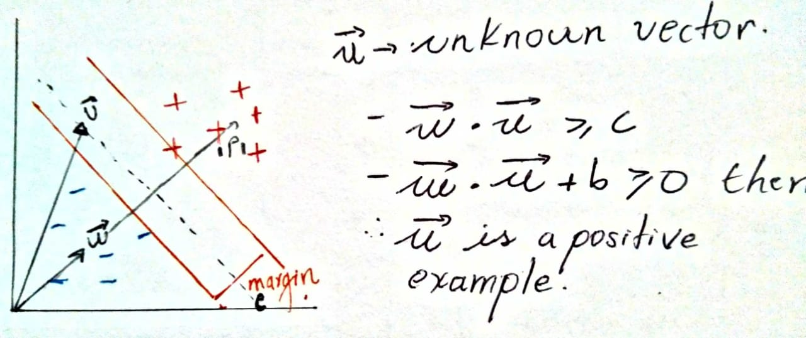
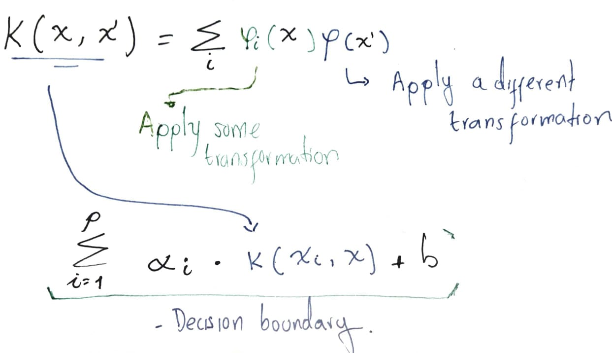

# A Training Algorithm for Optimal Margin Classifiers

## Intuiton

Classifiers with a large number of adjustable parameters are likely to overfit with the training data and be hopeless with generalization; Conversely, a classifier with insufficient capacity might not be able to learn the task at all.
The paper describes a training algorithm that automatically tunes the capacity of the classication function by maximizing the margin between training examples and class boundary. This summary joins the paper ideas and the intuiton explained in the classroom.

The following image shows the main idea, lets say we have some examples, in the "right" side of the street we have positive examples and in the left side of the "street" we have negative examples.

We don't know the **W** vector yet, but we know that this vector is perpendicular to the gutters, so, the dot product between **W** and the unknown **U** vector will give us the proyection **P** that lead us to the following conclusion:

Now, we want to insist if the unknown vector is a positive example or a negative example must be as far as possible from the decision boundary, this can be achieved by the equation on the left, after that, lets apply mathematical plumbing by adding a new variable **Y** which is _-1_ when it is  a negative example, and _1_ when it is a positive example. And it turns out that we get the same equation!

That can be expressed as follow for an example in the gutters:

So far, we've defined a way to classify whether an example is a positive one or a negative one, also,we come up with a equation that defines the _support vector_ or an example inside the gutter.

Now, lets see the gutter width and how can be expressed. Regarding that **W** is a vector perpendicular to the street the following image explains the intuiton of the gutter.

## Maximizing the problem

Our objective is to minimize the norm of **W** but in our problem we define earlier a constraint that must be fulfil  _[Equation 1]_, this objective can be achivied by means of the Lagrangian like follows:

<!---
Latex Snippet to the image below
[([L = \frac{1}{2} ||W||^2 - \sum_{i=1}^{p} \alpha_i [y_i(\vec{W * \vec{X_i} +b))] \\ \text{Subject to } \alpha_i \ge 0 \\ \\ \frac{\partial L}{\partial \vec{W}} =  W - \sum_{i=1}^{p} \alpha_i y_i \vec{X_i} = 0 \\ \\ hence, \vspace{23mm}  W = \sum_{i=1}^{p} \alpha_i y_i \vec{X_i}])]
-->

Now we will take the partial derivative with respect to b:

<!---
Latex Snippet to the image below
L = \frac{1}{2} ||W||^2 - \sum_{i=1}^{p} \alpha_i [y_i(\vec{W} * \vec{X_i} +b))] \\ 
\frac{\partial L}{\partial b} = - \sum_{i=1}^{p} \alpha_i y_i = 0
-->

We have figure out that the Lagrangian **L** doesn't deppend on the weight vector **W** but in the  linear combination of "some" examples that we denote as _suport vectors_, some examples because for some of them alpha will be zero.

## Dual Space

In the dual space, the decision functions are of the form:

The coeficients *alpha* are the parameters to be adjusted and the **X_i** are the training examples. The function K is a predefined kernel that allows the algorithm to learn decision boundaries in higher dimensions and there is not need to worry about some transformation because this kernel function will return a complex transformation obtained by the dot product in some space. If you noticed the form of the dual space has the same spirit explained in the intuiton above and the Kernel function doesn't modify anything at all.

The kernel trick applies transformation in the input data as follow:

Some famous kernels are: 

 * Linear Kernel

 * Radial Basis Function

## Properties of the solution

* Since maximizing the margin between the decision boundary and the training examples is equivalent to maximizing a quadratic form in the positive quadrant, there are no local minima and the solution is unique.

* Another benefit of the maximum margin objective is its insensitivity to small changes of the parameters w or *alpha* . Since the decision function is a linear function of w in the direct space,and of *alpha* in the dual space, the probability of misclassications due to parameter variations of the components of these vectors is minimized for maximum margin.

